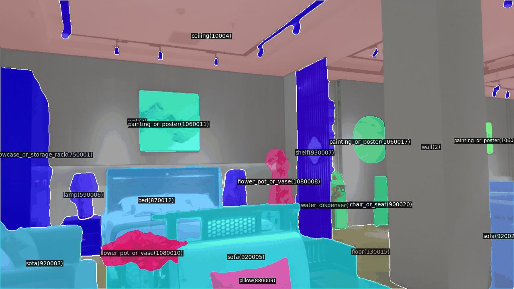
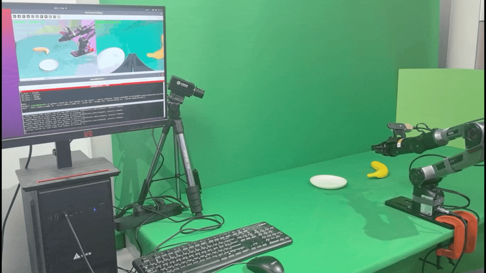

# 具身智能实验室

实验室面向机器人在真实环境中的感知、导航与操作，研究如何结合多模态传感、语言理解和机器人控制，让机器人通过与环境交互完成任务。研究与验证覆盖仿真环境、室内居家场景和多类型机器人平台。

  <a href="#实验室介绍">实验室介绍</a> &middot;
  <a href="#实验室成果">实验室成果</a>

## 实验室介绍

实验室依托西电-荣耀通信互联创新联合实验室建设室内居家机器人研究环境，包含客厅、厨房、卧室、健身区等多样化场景，布置有 300 余类物体，并设置不同地面和活动区域以支持机器人实验。

  
  

机器人实验区与居家场景

实验室配备人形机器人、四足机器人、机械臂及轮式移动操作平台，可支持从单体操作到移动操作的实验。

<table>
  <tr>
    <td align="center" width="50%"> <strong>人形机器人：智元 X1、宇树 G1</strong></td>
    <td align="center" width="50%"> <strong>机械臂：松灵 Piper</strong></td>
  </tr>
  <tr>
    <td align="center" width="50%"> <strong>四足机器人：宇树 Go2</strong></td>
    <td align="center" width="50%"> <strong>轮式移动操作平台：松灵 Piper 轮式智能车与机械臂</strong></td>
  </tr>
</table>

## 实验室成果

### 多模态感知：数据集与算法

建设仿真和真实机器人多模态数据资源，提供 RGB、深度、点云及语义标注；围绕这些数据开展机器人视频场景解析，并研究雨、雾、模糊、噪声等退化条件下的红外-可见光视频融合。仿真数据集 RoboMM-Syn 覆盖约 15,000 个实例；真实数据集包含 1,000 段视频、100,532 帧和 200 个语义类别。

详情包括数据集信息、算法框架和实验结果，见[多模态感知成果介绍](multimodal-perception/README.md)。数据集入口：[RoboMM-Syn 仿真数据集](https://www.modelscope.cn/datasets/XDUEaiLAB/RoboMM-Syn)、[真实机器人多模态感知数据集](https://www.modelscope.cn/datasets/XDUEaiLAB/Robot_multimodal_perception_dataset)。

  

室内视频场景解析示例

### 视觉语言导航（VLN）

面向连续三维环境中的自然语言指令导航，研究在线轨迹训练与纠偏，并提升局部运动在真实机器人上的可执行性。R2R-CE 上 SR/SPL 为 57.6%/51.1%，RxR-CE 上为 56.1%/46.6%；另在 Unitree Go2 上开展走廊、卧室和跨房间等实机测试。

算法流程、仿真指标和实机验证见[视觉语言导航成果介绍](vln/README.md)。

### 视觉语言动作（VLA）

支持部署并按任务微调开源视觉语言动作模型，包括 OpenVLA、π0 和 SmolVLA 等；同时研究压缩视觉输入下的远程机器人操作。现有材料报告 CALVIN 波动带宽条件下五步任务成功率为 56.9%，平均完成长度为 3.758，并在 AgileX 单臂平台开展受限网络链路测试。

算法框架、仿真评估和实机结果见[视觉语言动作成果介绍](vla/README.md)。

  
  

  桌面操作实验&nbsp;&nbsp;受限带宽下的远程机器人操作

各方向的算法、实验条件与指标请以对应成果页面为准；不同数据集和测试设置下的结果不作直接横向比较。
