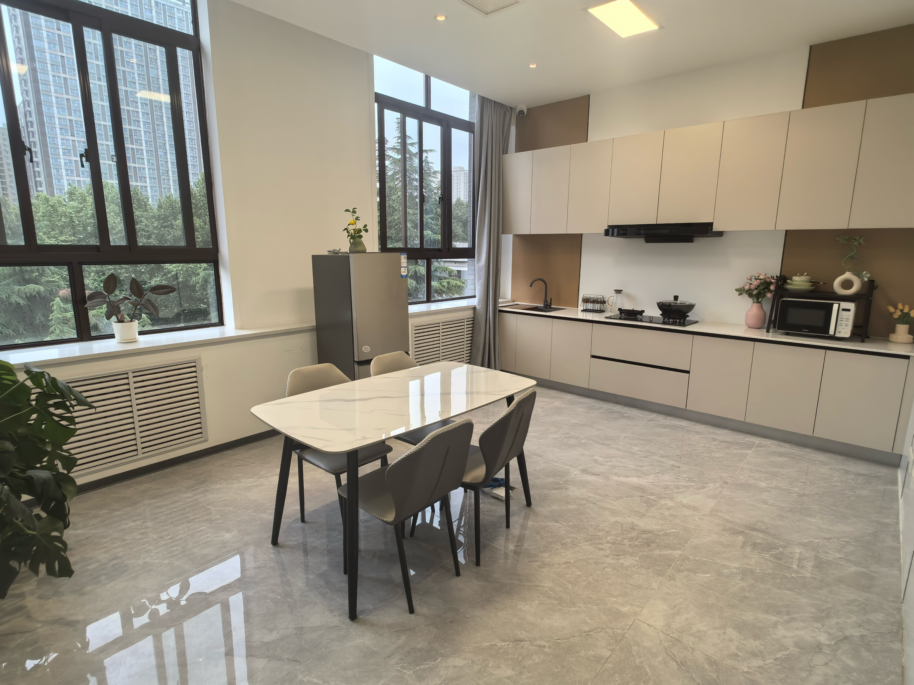

# 具身智能实验室

实验室面向机器人在真实环境中的感知、导航与操作，研究如何结合多模态传感、语言理解和机器人控制，让机器人通过与环境交互完成任务。研究与验证覆盖仿真环境、室内居家场景和多类型机器人平台。

  <a href="#实验室介绍">实验室介绍</a> &middot;
  <a href="#实验室成果">实验室成果</a> &middot;
  <a href="#算法介绍">算法介绍</a> &middot;
  <a href="datasets/README.md">数据资源</a>

## 实验室介绍

实验室依托西电-荣耀通信互联创新联合实验室建设室内居家研究与测试环境，覆盖客厅、厨房、卧室、健身房等场景，包含 300 余类物体。实验室配备人形、四足、轮式机器人和机械臂，可开展环境感知、建图导航、自主探索及桌面操作研究。

| 平台类型 | 设备 |
|---|---|
| 人形机器人 | 智元 X1、宇树 G1 |
| 四足机器人 | 宇树 Go2 |
| 机械臂 | 松灵 Piper |
| 轮式移动操作平台 | 松灵 Piper 轮式智能车与机械臂 |

## 实验室成果

| 方向 | 成果概览 | 数据或验证 |
|---|---|---|
| **多模态数据资源** | 建设 Isaac Sim 仿真数据与真实环境机器人多模态数据，提供 RGB、深度、点云和语义标注等信息。仿真数据覆盖约 15,000 个实例；真实数据包含 1,000 段视频、100,532 帧和 200 个语义类别。 | [仿真数据集 RoboMM-Syn](https://www.modelscope.cn/datasets/XDUEaiLAB/RoboMM-Syn)；[真实多模态感知数据集](https://www.modelscope.cn/datasets/XDUEaiLAB/Robot_multimodal_perception_dataset) |
| **机器人环境感知** | 融合视觉与时序几何信息，研究机器人视频场景解析；同时探索多种退化下的红外-可见光视频融合。 | 在 VIPSeg、VSPW、RC-MVSP 及多退化视频融合数据上评估。详见[多模态感知成果](multimodal-perception/README.md)。 |
| **建图、导航与自主探索** | 开展机器人定位建图、路径规划和陌生环境自主探索，覆盖仿真演示与实机测试。 | 当前导航规划使用 A* 全局规划与 DWA 局部规划。 |
| **视觉语言导航** | 研究自然语言指令驱动的连续环境导航，并通过在线训练和历史轨迹校正提升指令跟随能力。 | R2R-CE 上 SR/SPL 为 57.6%/51.1%；RxR-CE 上为 56.1%/46.6%。另在 Unitree Go2 场景开展实机验证。详见[导航成果](vln/README.md)。 |
| **视觉语言动作** | 支持部署并按任务微调开源视觉语言动作模型；研究压缩视觉输入下的远程机器人操作。 | 覆盖 OpenVLA、π0、SmolVLA 等模型；CALVIN 波动带宽下五步任务成功率为 56.9%，平均完成长度为 3.758。详见[操作成果](vla/README.md)。 |

## 算法介绍

### 多模态环境感知

面向 RGB、深度、点云和 IMU 等异构信号，研究信号级与特征级融合，并结合时序几何先验进行跨帧特征聚合，输出视频语义与全景场景解析结果。

### 建图导航与未知环境探索

机器人通过传感器观测完成定位与地图构建，再由全局路径规划和局部运动规划协同生成导航动作。探索算法在仿真环境和真实机器人上开展自由探索测试。

### 视觉语言导航

模型依据自然语言指令和当前视觉观测预测导航动作，并利用在线轨迹反馈进行训练与校正。困难样本可从历史有效状态继续生成监督，降低偏离后的错误累积。方法与实验摘要见[在线导航训练与轨迹校正](vln/online-nav-training.md)。

### 视觉语言动作与远程操作

视觉语言动作模型将图像和任务指令转化为机械臂动作。针对网络带宽受限的场景，算法提取图像压缩退化信息并用于视觉表征适配和动作生成，评估覆盖多档固定及波动带宽。详情见[低带宽远程操作](vla/bandwidth-robust-control.md)。

## 成果展示

  
  
  

  室内居家实验场景
  &nbsp;&nbsp;
  机器人多模态场景解析
  &nbsp;&nbsp;
  AgileX 远程操作：高带宽与波动带宽条件

更多数据配置、算法流程和实验指标见各方向页面。实验结果均应结合对应基准、平台及测试条件理解。
