# 具身智能实验室

[多模态感知](multimodal-perception/README.md) · [视觉语言导航 VLN](vln/README.md) · [视觉语言动作 VLA](vla/README.md) · [开放数据集](datasets/README.md)

## 实验室介绍

| 场地与平台 | 配置 |
| --- | --- |
| 依托平台 | 西电-荣耀通信互联创新联合实验室 |
| 居家场景 | 客厅、厨房、卧室、健身区，300+ 类物体 |
| 机器人实验区 | 沙地、坡道、草地及室内活动区域 |
| 硬件 | 智元 X1、宇树 G1、宇树 Go2、松灵 Piper 机械臂与轮式移动操作平台 |

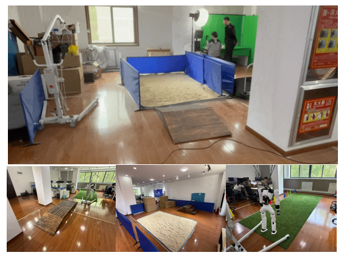
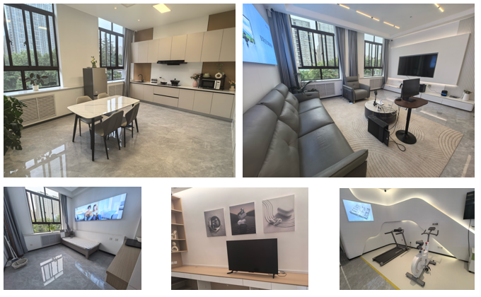

<table>
<tr>
<td width="50%" align="center">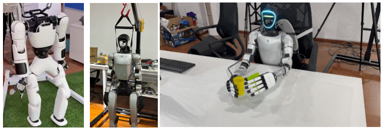 智元 X1 · 宇树 G1</td>
<td width="50%" align="center">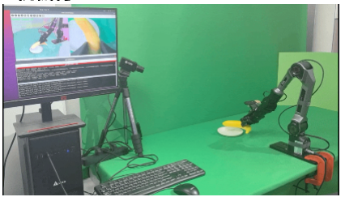 松灵 Piper 机械臂</td>
</tr>
<tr>
<td align="center">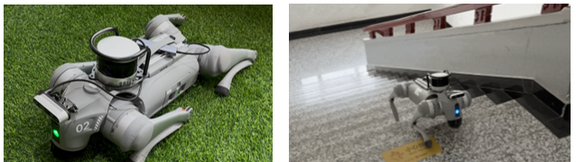 宇树 Go2</td>
<td align="center">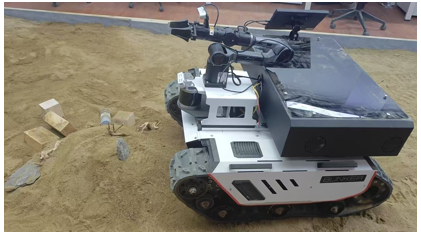 Piper 轮式智能车与机械臂</td>
</tr>
</table>

## 实验室成果

| 方向 | 成果 | 图表详情 |
| --- | --- | --- |
| 多模态感知 | RoboMM-Syn、RC-MVSP、GDAFormer、MDV-Fusion | [数据集与算法](multimodal-perception/README.md) |
| VLN | BudVLN、VeSTA、语言指令导航实机演示 | [框架与实验](vln/README.md) |
| VLA | 开源模型部署与微调、CR-VLA 远程操作 | [框架与实验](vla/README.md) |

### 多模态感知

| 数据资源 | 规模 | 开源入口 |
| --- | --- | --- |
| RoboMM-Syn 仿真数据集 | 约 15,000 个实例级对象 | [ModelScope](https://www.modelscope.cn/datasets/XDUEaiLAB/RoboMM-Syn) |
| 真实机器人多模态感知数据集 | 1,000 段视频、100,532 帧、200 类 | [ModelScope](https://www.modelscope.cn/datasets/XDUEaiLAB/Robot_multimodal_perception_dataset) |

<table>
<tr><th width="50%">室内视频场景解析</th><th width="50%">室外视频场景解析</th></tr>
<tr>
<td>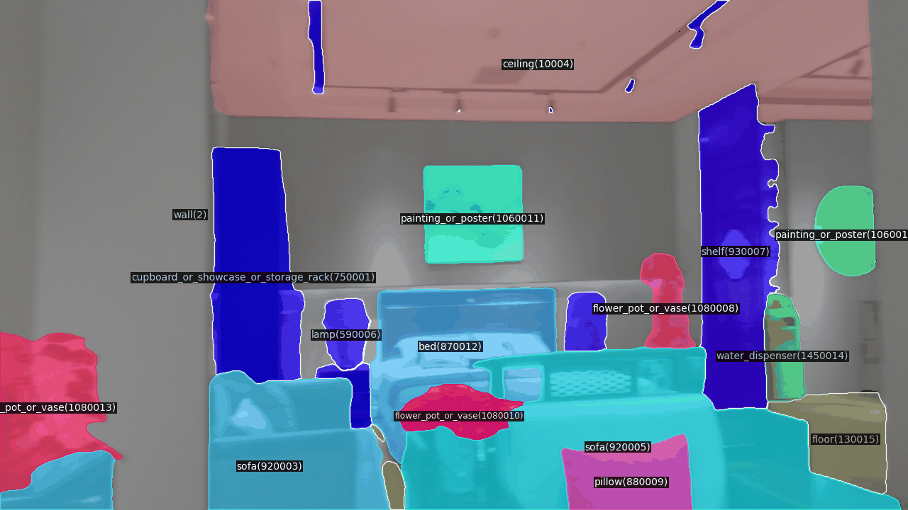</td>
<td>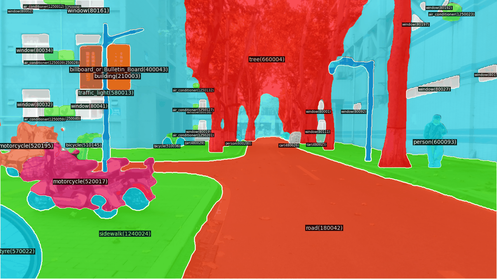</td>
</tr>
</table>

[数据样例、GDAFormer 与 MDV-Fusion 框架和结果 →](multimodal-perception/README.md)

### 视觉语言导航 VLN

| 方法 | 测试设置 | 代表结果 |
| --- | --- | --- |
| BudVLN | R2R-CE / RxR-CE，Val Unseen | SR：57.6% / 56.1%；SPL：51.1% / 46.6% |
| VeSTA | Go2 无碰撞成功率，每场景 20 条指令 | 走廊 95%；卧室 65%；跨房间 45% |

<table>
<tr><th width="50%">出门右转，在红色灭火器前停下</th><th width="50%">直行走出房间，进入左边的房间，在冰箱前停下</th></tr>
<tr>
<td align="center">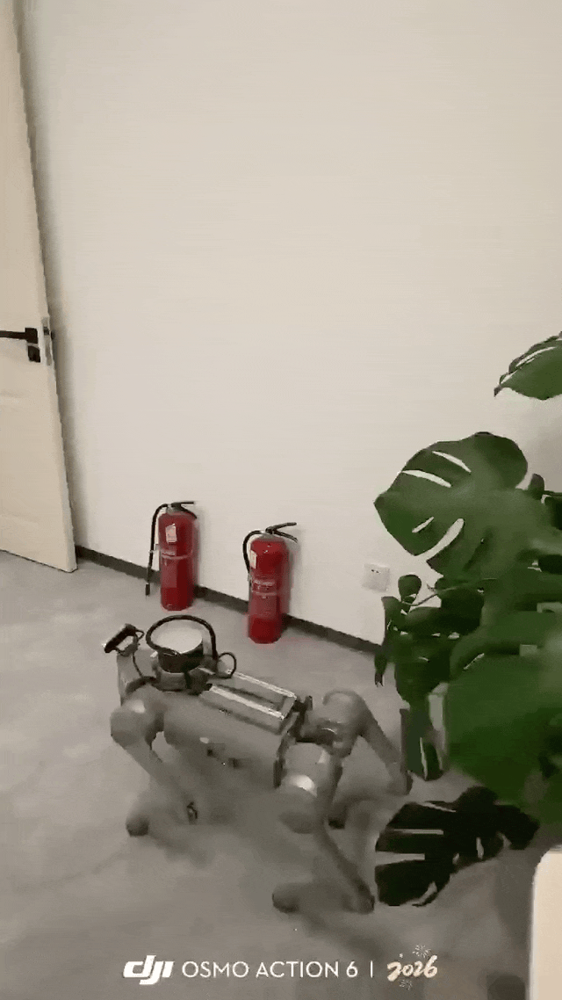</td>
<td align="center">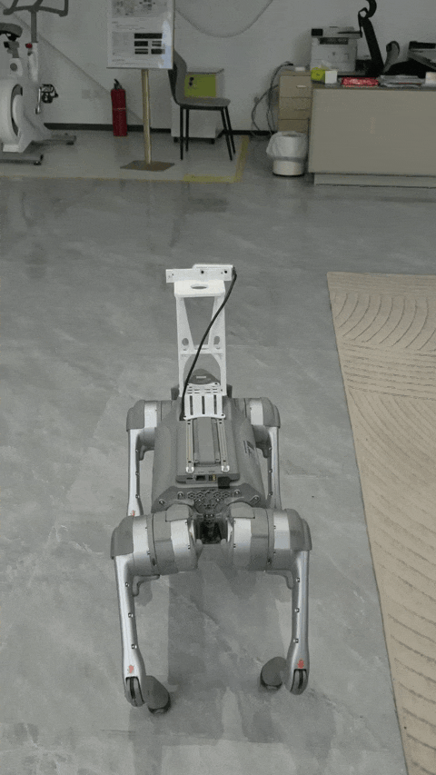</td>
</tr>
</table>

[BudVLN、VeSTA 算法框架、对比表和轨迹图 →](vln/README.md)

### 视觉语言动作 VLA

| 能力 / 方法 | 设置 | 展示与结果 |
| --- | --- | --- |
| 开源 VLA 部署与微调 | OpenVLA、π0、SmolVLA 等 | 抽屉、物体抓放、组合餐具操作 |
| CR-VLA | CALVIN 波动带宽 | 五步成功率 56.9%；平均完成长度 3.758 |
| CR-VLA | AgileX 实机波动带宽，每任务 20 次 | 香蕉 80%；叠盘 65%；餐具 60%；抽屉 60% |

<table>
<tr><th>抽屉与茄子操作</th><th>组合餐具操作</th><th>香蕉放入盘子</th></tr>
<tr>
<td width="33%">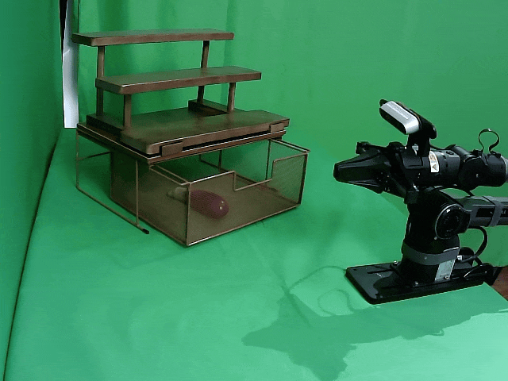</td>
<td width="33%">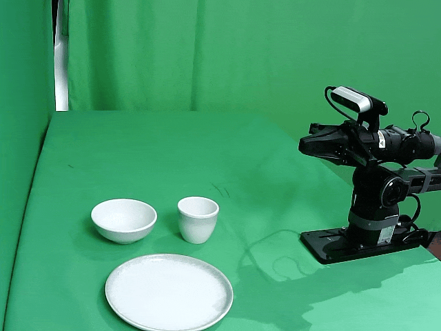</td>
<td width="33%">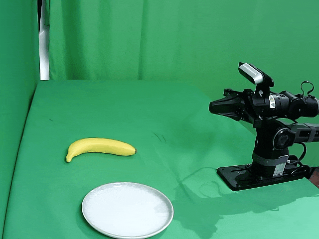</td>
</tr>
</table>

[CR-VLA 框架、LIBERO / CALVIN 表格与实机结果 →](vla/README.md)

### 数据采集、建图与探索演示

<table>
<tr><th>仿真多模态数据采集</th><th>建图与路径规划</th><th>未知环境仿真探索</th></tr>
<tr>
<td width="33%">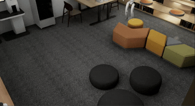</td>
<td width="33%">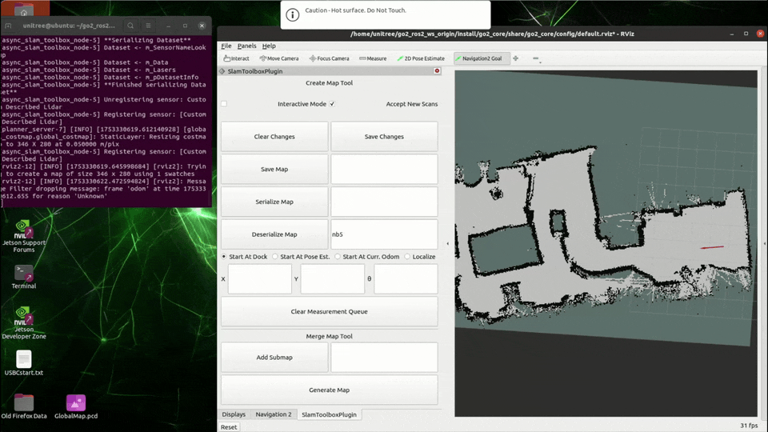</td>
<td width="33%">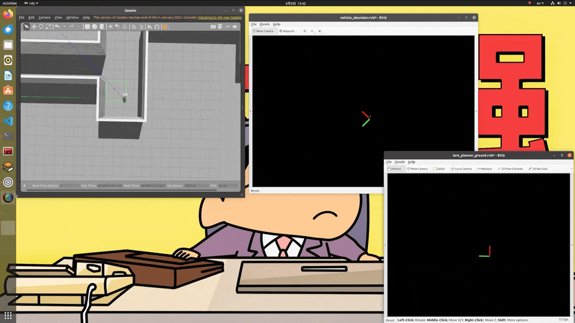</td>
</tr>
</table>

动态演示均为展示 PPT 中的原始 GIF。PPT 演示与论文实验分别展示，不将演示视频等同于某一论文方法的测试结果。各方法独立评估，具体设置见子页面。
