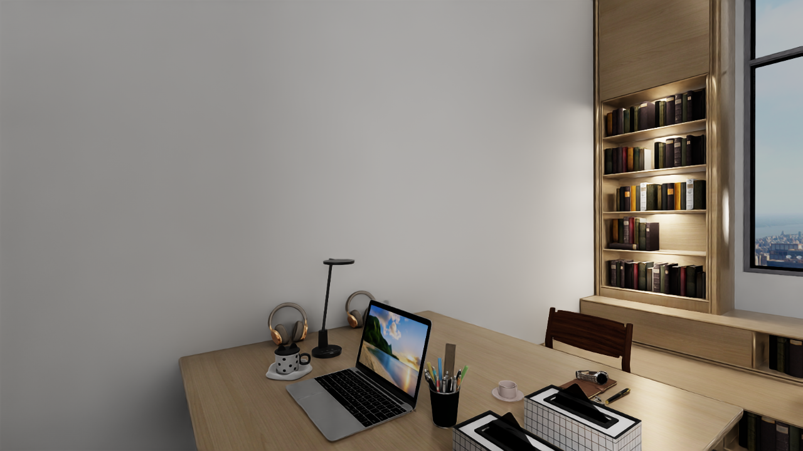
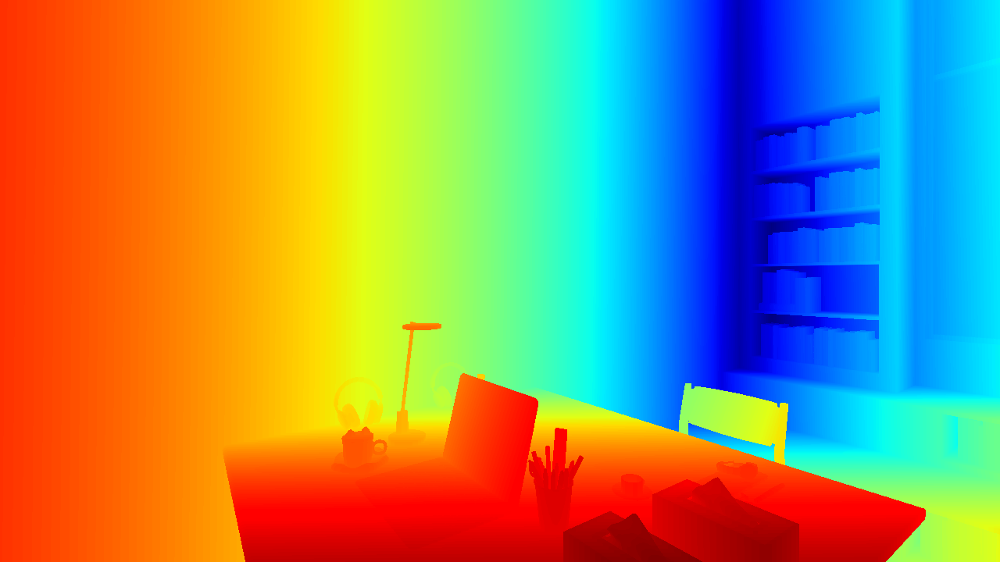
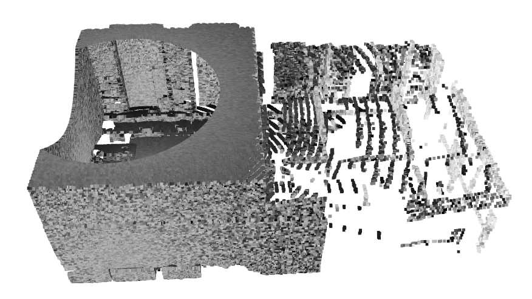
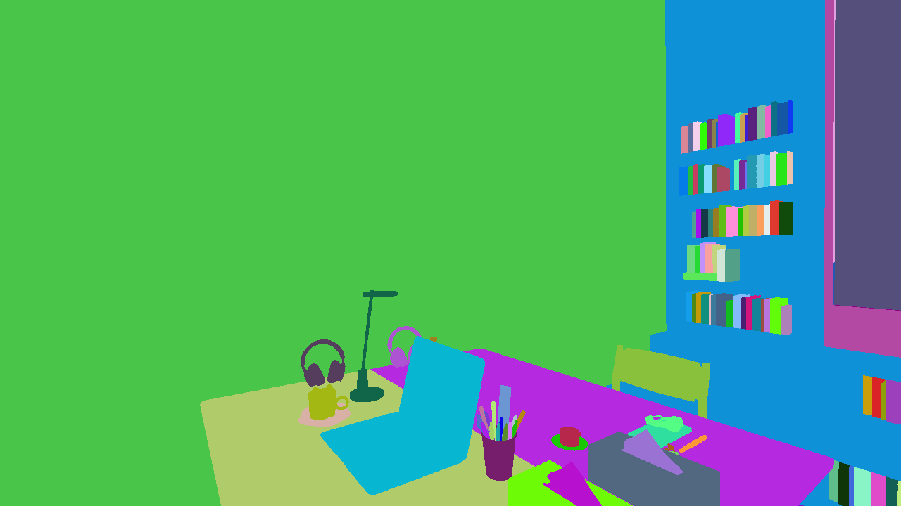
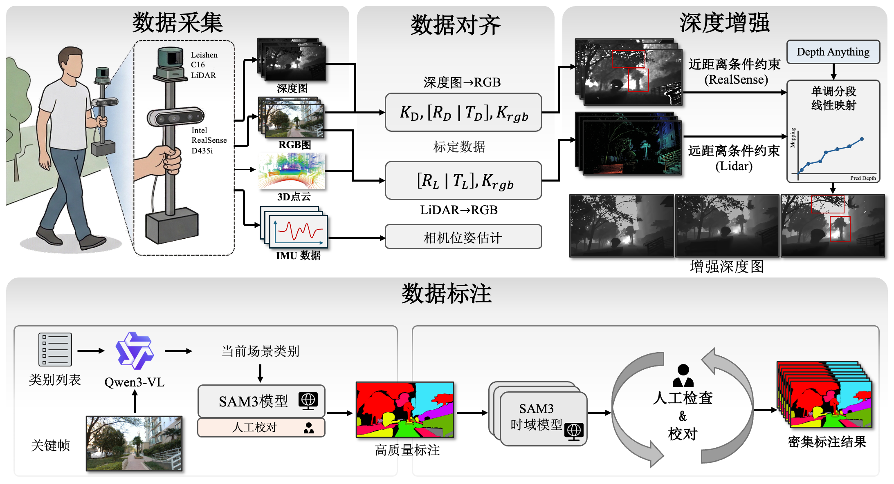
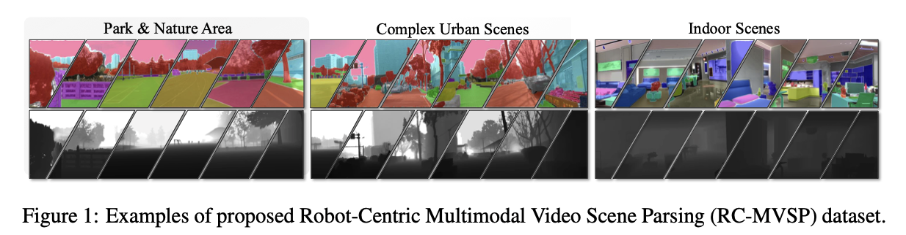
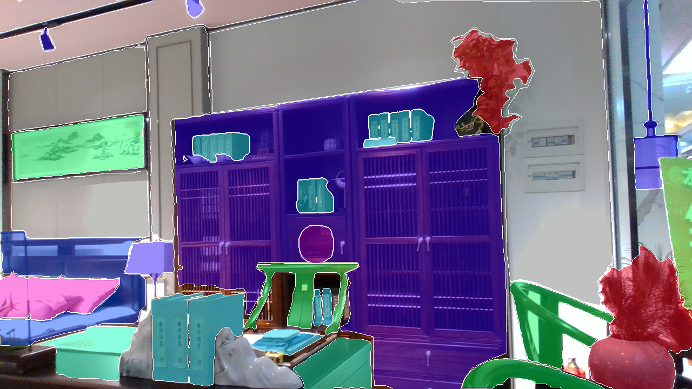
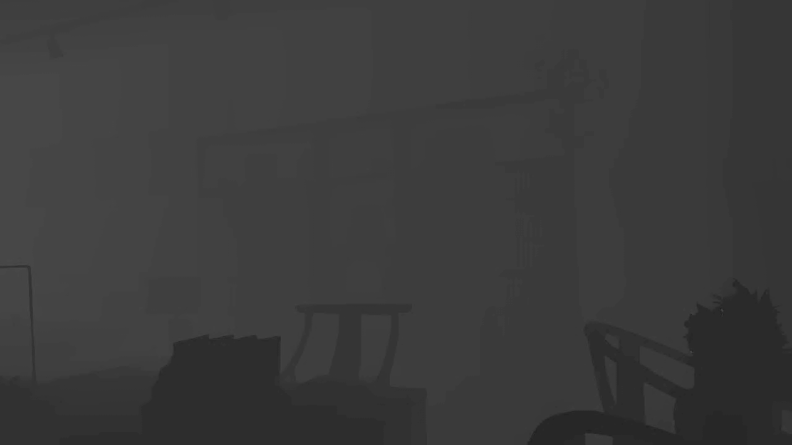
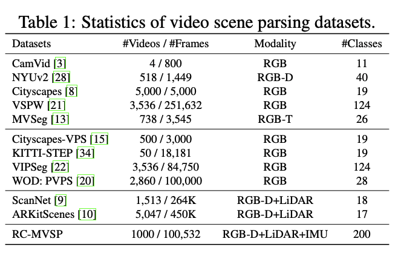

# 开放多模态数据集

[返回主页](../README.md) · [多模态感知成果](../multimodal-perception/README.md)

| 项目 | RoboMM-Syn 仿真数据集 | 真实机器人多模态感知数据集 |
| --- | --- | --- |
| 下载 | [ModelScope](https://www.modelscope.cn/datasets/XDUEaiLAB/RoboMM-Syn) | [ModelScope](https://www.modelscope.cn/datasets/XDUEaiLAB/Robot_multimodal_perception_dataset) |
| 场景 | 阅览室、幼儿园、居家等 | 客厅、厨房、卧室、街道、小区、学校、公园等 |
| 规模 | 约 15,000 个实例级对象 | 1,000 段视频、100,532 帧、200 类 |
| RGB / 深度 | 1280 × 720 | 1280 × 720 |
| 平均点云规模 | 约 300,000 点 / 帧 | 约 100,000 点 / 帧 |
| 平台 | Isaac Sim、GRUtopia 场景资源、宇树 G1 | 自建多模态采集设备 |
| 传感器 | RGB-D 相机、Ouster OS0 LiDAR | RealSense D435i、Leishen C16 LiDAR |
| 数据 | RGB、深度、点云、分割标注 | 对齐 RGB-D、点云、IMU 与场景标注 |

## RoboMM-Syn

<table>
<tr><th>RGB</th><th>深度</th></tr>
<tr><td width="50%"></td><td width="50%"></td></tr>
<tr><th>点云</th><th>分割标注</th></tr>
<tr><td></td><td></td></tr>
</table>

## 真实数据采集与 RC-MVSP

| RGB 样例 | 分割标注样例 |
| --- | --- |
|  |  |

### 数据集统计对比

来源：展示 PPT 第 7–11、13–14 页。规模采用 PPT 口径；GRUtopia 资源平台总规模不计为 RoboMM-Syn 数据规模。下载文件、划分与许可以数据集页面为准。
