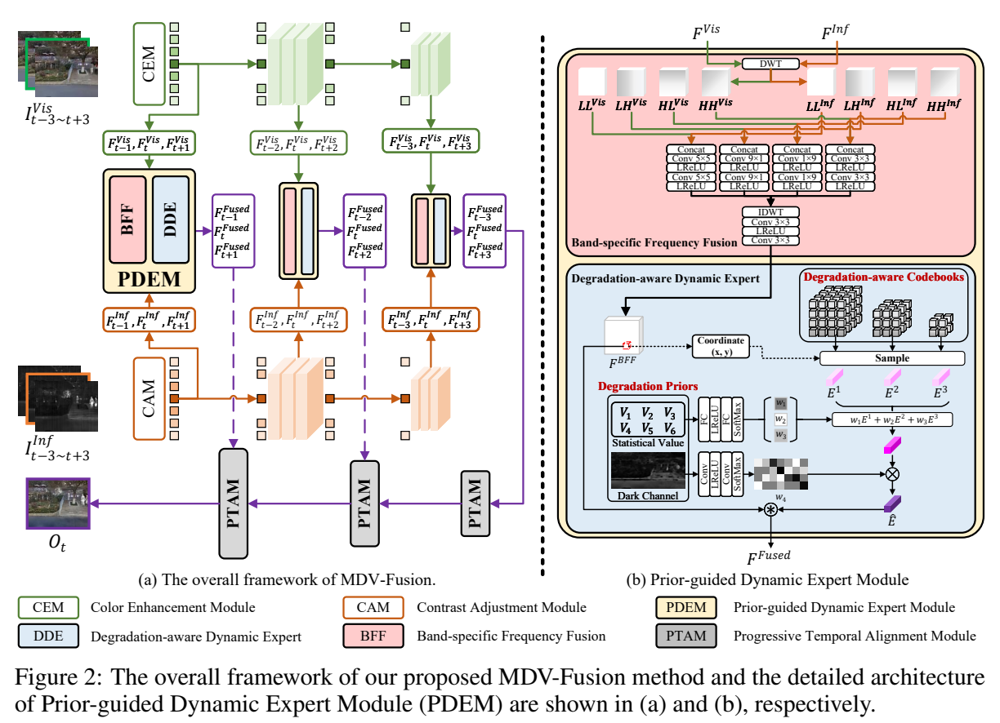
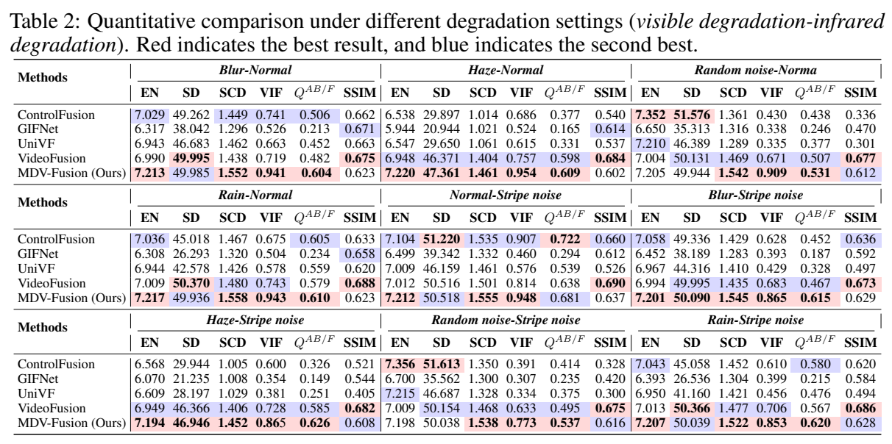
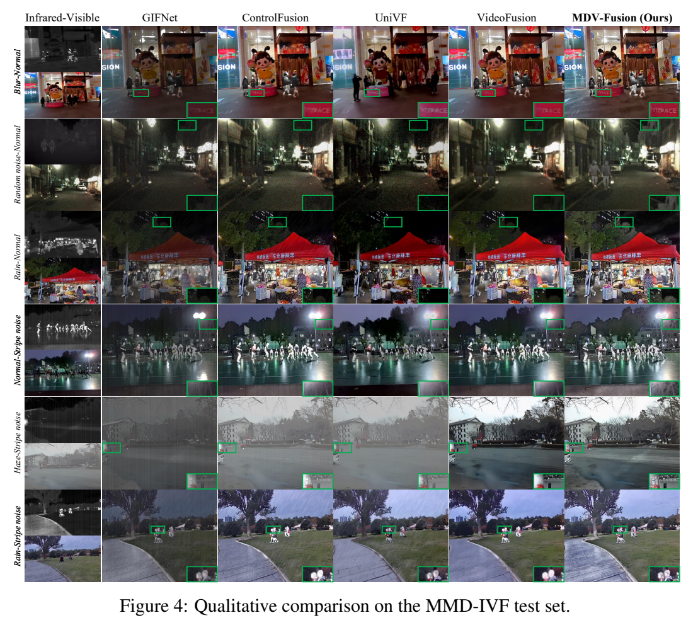

# MDV-Fusion：多退化视频融合

[返回多模态感知](README.md) · [实验室主页](../README.md)

*Multiple Degradation-aware Video Fusion Network*

| 输入 | 关键模块 | 输出 |
| --- | --- | --- |
| 红外与可见光视频 | CEM / CAM 模态增强 | 多尺度模态特征 |
| 退化先验与双模态特征 | PDEM 先验引导动态专家、频带融合 | 退化鲁棒融合特征 |
| 相邻帧融合特征 | PTAM 渐进时序对齐 | 融合视频 |

## 算法框架

## 定量结果

| HDO 测试指标 | MDV-Fusion |
| --- | ---: |
| EN ↑ | 7.471 |
| SD ↑ | 50.027 |
| SCD ↑ | 0.747 |

| 计算开销 | 数值 |
| --- | ---: |
| 参数量 | 4.841 M |
| FLOPs | 326.47 G |
| 推理时间（128 × 128 patch） | 0.060 s / 帧 |

## 融合效果对比

来源：所提供 MDV-Fusion 论文图 2、表 2、图 4及实验部分。HDO 与 MMD-IVF 为不同测试设置。
