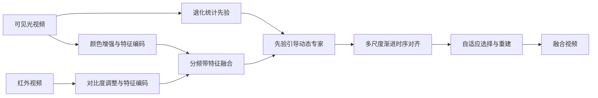

# 多退化条件下的红外-可见光视频融合

## 方法框架

针对雨、雾、模糊、随机噪声和条纹噪声等退化，分别提取红外与可见光视频特征。频带处理融合热目标与纹理细节；退化统计先验驱动动态专家调整融合特征；随后通过多尺度渐进式时序对齐聚合前后帧信息，生成时间上连贯的融合视频。

## 结果概览

- 在包含雨、雾、模糊、噪声和条纹噪声等组合的退化视频测试集上，与图像级及视频级融合方法比较。
- 在完整退化测试集上，材料报告该方法在 EN、SD、SCD、VIF 与 QAB/F 指标上排名第一；正常退化子集上 EN、SCD 与 VIF 排名第一。
- 在独立 HDO 退化场景测试中，EN（7.471）、SD（50.027）和 SCD（0.747）优于对比方法；其他指标并非全部领先。
- 定性结果显示，在多种混合退化下融合结果保留了较清晰的热目标、纹理和边界；连续帧检测可视化显示目标定位更稳定。
- 复杂度测试报告 4.841M 参数、326.47G FLOPs；128×128 patch 上单帧约 0.060 秒。该设置下方法存在计算量与融合质量之间的权衡。

以上结果来自现有实验材料。EN、SD、SCD、VIF、QAB/F 等指标用于融合质量评价，不等同于机器人任务成功率。
