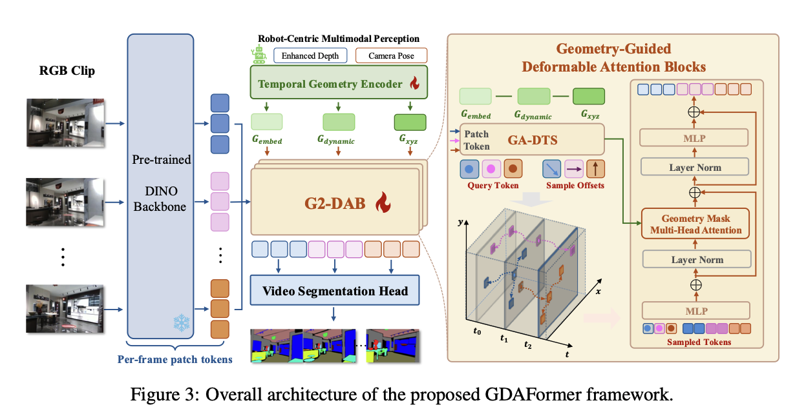
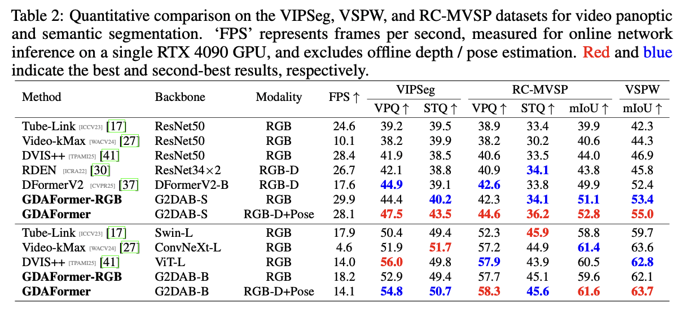

# GDAFormer：几何引导视频场景解析

[返回多模态感知](README.md) · [实验室主页](../README.md)

| 输入 | 关键模块 | 输出 |
| --- | --- | --- |
| RGB 视频、深度、相机位姿 | 时序几何编码、G2-DAB 几何引导可变形注意力 | 视频语义 / 全景分割 |
| 多尺度视觉特征 | 动态采样与跨帧特征聚合 | 时序场景解析结果 |

## 算法框架

## 数据与实验对比

## 动态结果

| 室内场景 | 室外场景 |
| --- | --- |
|  |  |
