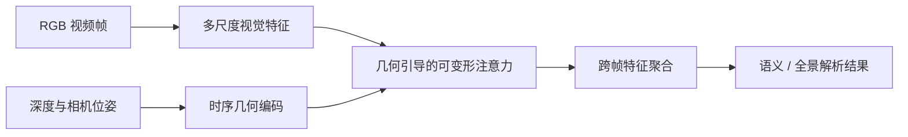
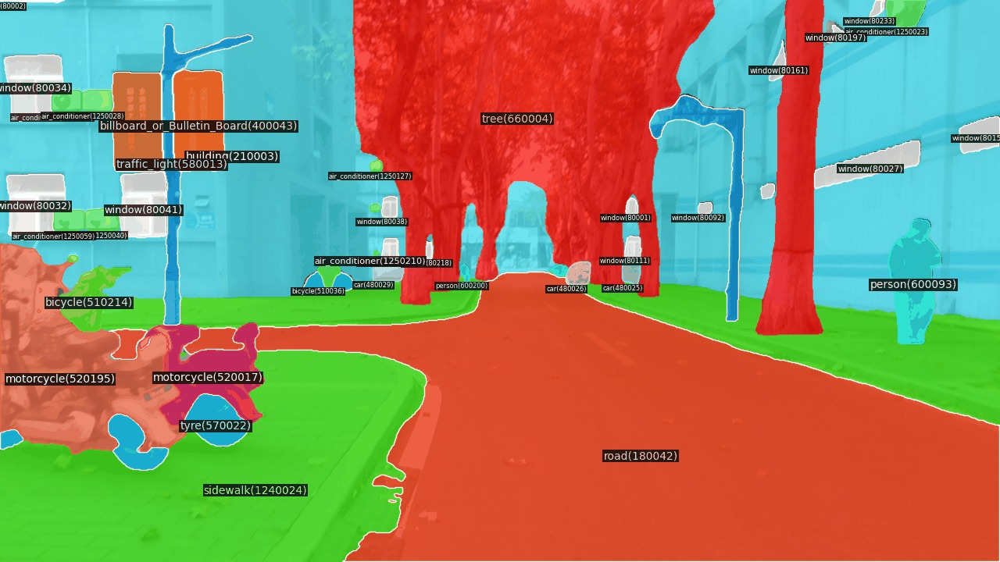

# 几何引导的机器人视频场景解析

## 方法框架

面向机器人连续运动中的视频语义与全景解析，将 RGB 外观特征与深度、相机位姿形成的时序几何信息结合。几何关系用于指导跨帧采样位置，使网络优先聚合与当前场景结构相对应的信息。

## 结果概览

- 在 VIPSeg、VSPW 与机器人中心视频场景解析数据上进行评估。下表按配置 1、配置 2 汇总 PPT 中 RGB 与 RGB-D+位姿输入对应的结果。
- 通过几何先验与动态跨帧采样增强视频场景解析；实验材料同时展示了多模态输入与机器人视角下的解析应用。
- PPT 中的算法演示覆盖室内居家场景与室外道路场景，展示机器人视角下对墙面、家具、道路、行人等区域的逐帧语义解析。

| 配置 | 输入 | 在线速度（FPS） | VIPSeg VPQ / STQ | RC-MVSP VPQ / STQ / mIoU | VSPW mIoU |
|---|---|---:|---:|---:|---:|
| 配置 1 | RGB | 29.9 | 44.4 / 40.2 | 42.3 / 34.1 / 51.1 | 53.4 |
| 配置 1 | RGB-D + 位姿 | 28.1 | 47.5 / 43.5 | 44.6 / 36.2 / 52.8 | 55.0 |
| 配置 2 | RGB | 18.2 | 52.9 / 49.4 | 57.7 / 45.1 / 59.6 | 62.1 |
| 配置 2 | RGB-D + 位姿 | 14.1 | 54.8 / 50.7 | 58.3 / 45.6 / 61.6 | 63.7 |

在 PPT 所列设置中，增加深度与位姿输入后，多数场景解析指标提升；在线速度相应下降，且 VSPW mIoU 在配置 2 下略低于 RGB 单模态结果。不同模型设置的速度与精度应结合输入方式一并解读。

- 速度测试采用单张 RTX 4090，统计在线网络推理，不包含离线深度和位姿估计。

  
  

室内与室外场景解析演示

具体指标应与对应基准、输入模态和测试设置一并报告；此处不将不同设置下的数值合并比较。
