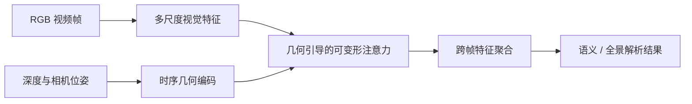

# 几何引导的机器人视频场景解析

## 方法框架

面向机器人连续运动中的视频语义与全景解析，将 RGB 外观特征与深度、相机位姿形成的时序几何信息结合。几何关系用于指导跨帧采样位置，使网络优先聚合与当前场景结构相对应的信息。

## 结果概览

- 在 VIPSeg、VSPW 与机器人中心视频场景解析数据上进行评估。
- 通过几何先验与动态跨帧采样增强视频场景解析；实验材料同时展示了多模态输入与机器人视角下的解析应用。
- 速度测试采用单张 RTX 4090，统计在线网络推理，不包含离线深度和位姿估计。

具体指标应与对应基准、输入模态和测试设置一并报告；此处不将不同设置下的数值合并比较。
