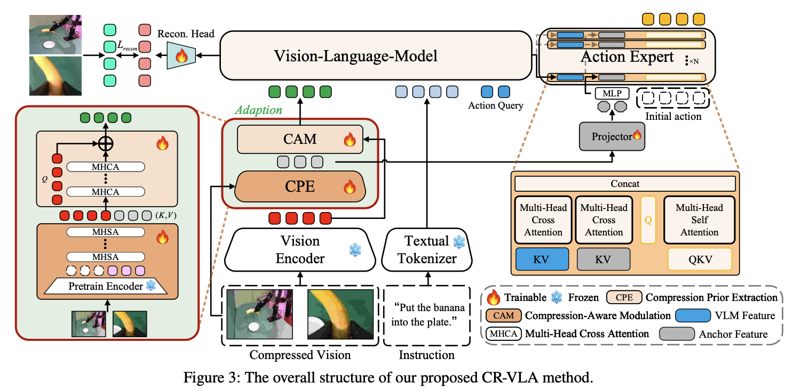
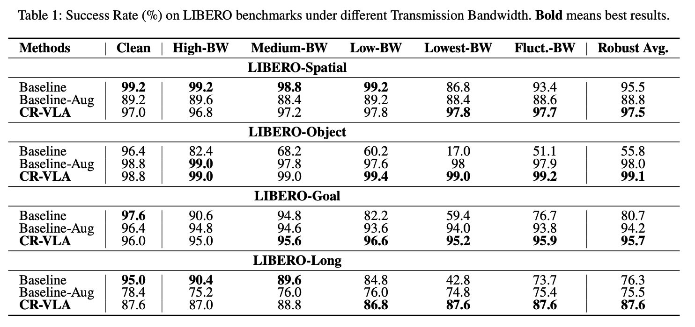
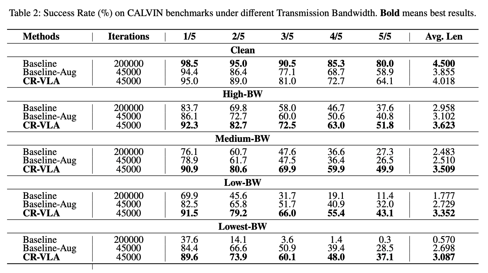
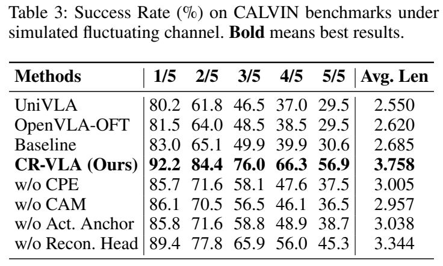
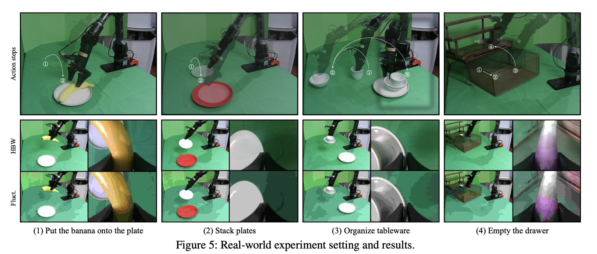
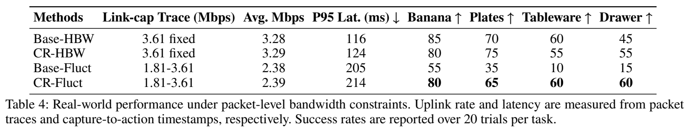

# CR-VLA：压缩鲁棒远程操作

[返回 VLA](README.md) · [实验室主页](../README.md)

*CR-VLA: Compression-Robust Vision-Language-Action models for Remote Deployment*

| 模块 | 作用 |
| --- | --- |
| CPE 压缩先验提取 | 提取受损输入中的压缩退化特征 |
| CAM 压缩感知调制 | 使用压缩先验恢复视觉特征 |
| 重建辅助训练 | 对齐受损输入与目标表征 |
| 压缩先验动作锚定 | 将退化信息引入动作生成 |

## 算法框架

## LIBERO

| 波动带宽 | Spatial | Object | Goal | Long |
| --- | ---: | ---: | ---: | ---: |
| CR-VLA 成功率 | 97.7% | 99.2% | 95.9% | 87.6% |

## CALVIN

| 波动带宽 | 1 步 | 2 步 | 3 步 | 4 步 | 5 步 | 平均长度 |
| --- | ---: | ---: | ---: | ---: | ---: | ---: |
| CR-VLA | 92.2% | 84.4% | 76.0% | 66.3% | 56.9% | 3.758 |

## AgileX 实机结果

| 波动带宽 | 香蕉 | 叠盘 | 整理餐具 | 抽屉 | P95 延迟 |
| --- | ---: | ---: | ---: | ---: | ---: |
| Base-Fluct | 55% | 35% | 10% | 15% | 205 ms |
| CR-Fluct | 80% | 65% | 60% | 60% | 214 ms |

| 实机条件 | 配置 |
| --- | --- |
| 平台 | AgileX，6 自由度单臂与夹爪 |
| 视觉 | 主视角与腕部视角，640 × 480，10 Hz |
| 链路 | H.265 / RTP，机器人采集、远端 GPU 推理 |
| 波动带宽 | 链路容量 1.81–3.61 Mbps |
| 评估 | 每任务 20 次 |
