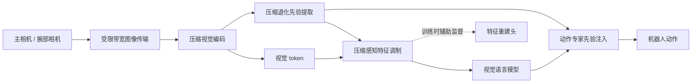

# 低带宽远程机器人的视觉与动作适配

## 方法框架

机器人端将主相机和腕部相机观测压缩后发送至远程推理端。模型显式提取压缩退化先验，用其调制视觉 token，并在训练阶段通过特征重建辅助恢复表征；同时将压缩先验注入动作专家，以稳定不同图像质量下的动作生成。

## 结果概览

- **LIBERO：** 四个任务套件在波动带宽下的成功率分别为 Spatial 97.7%、Object 99.2%、Goal 95.9%、Long 87.6%。
- **CALVIN：** 波动带宽条件下，完成 1 至 5 步任务的成功率依次为 92.2%、84.4%、76.0%、66.3%、56.9%；平均完成长度为 3.758。
- **实机远程操作：** AgileX 单臂、双相机、远程 GPU 推理；在波动链路下，四类桌面任务成功率由基线的 55/35/10/15% 提升到 80/65/60/60%。每项任务每种设置 20 次试验，P95 延迟由 205 ms 增至 214 ms。
- **训练设置：** 报告的适配训练为 45K 次迭代；此项结果与训练 200K 次的原始基线比较时，应结合模型和训练配方差异理解。

上述成功率来自各自指定的仿真或实机设置，不应跨基准直接比较。
