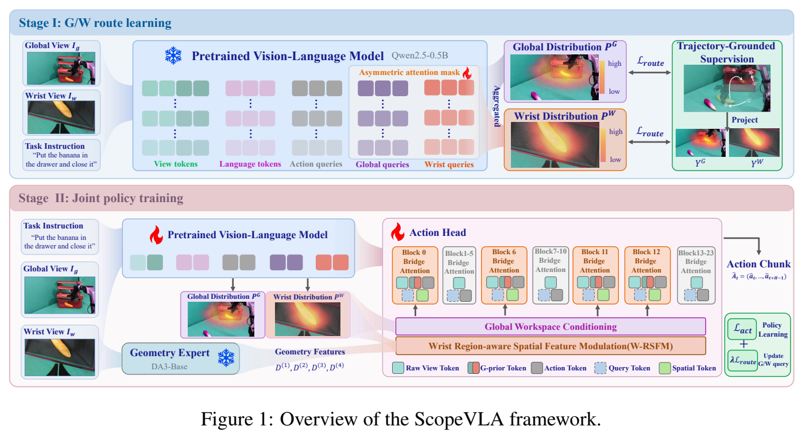
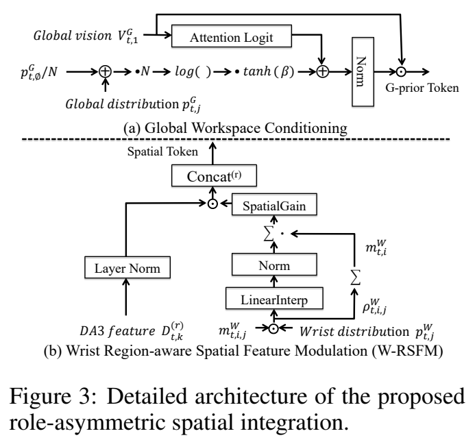
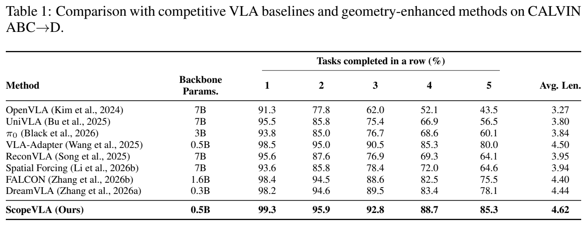
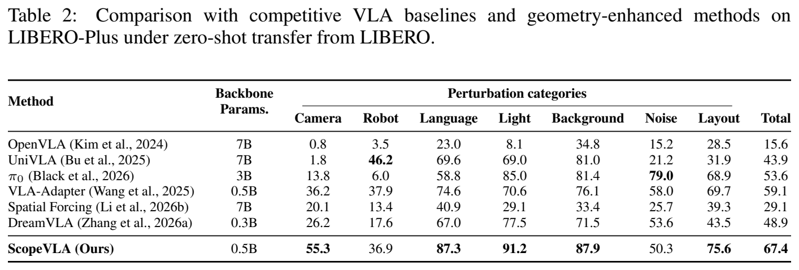
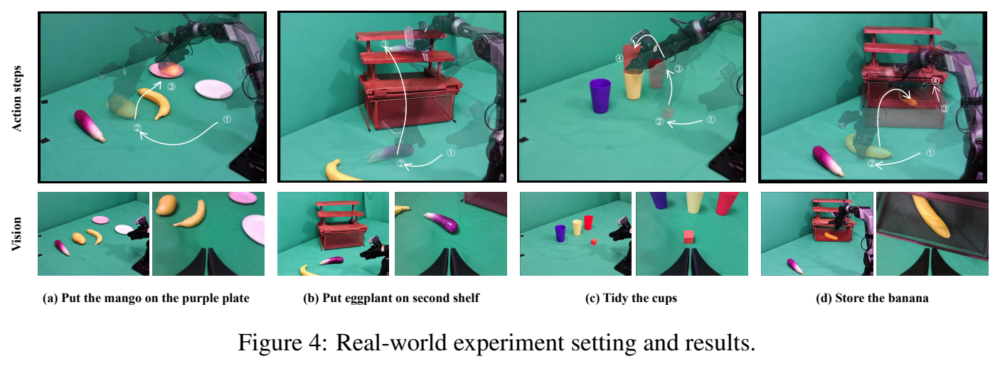
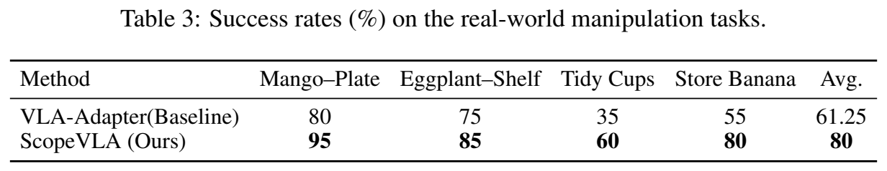
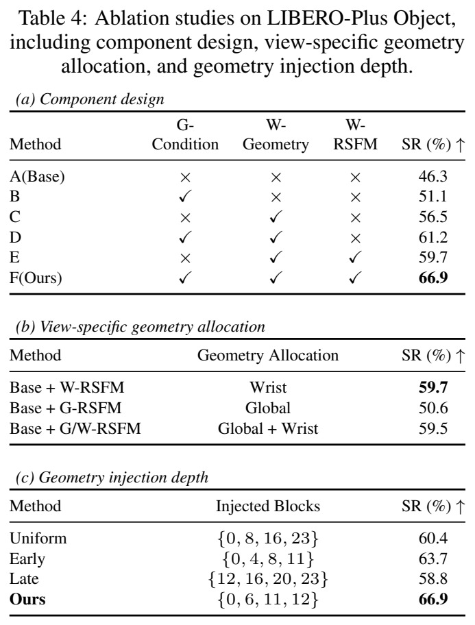

# ScopeVLA：任务驱动的多视角空间条件建模

[返回具身操作模型](README.md) · [实验室主页](../README.md)

*ScopeVLA: Task-Grounded and View-Specialized Spatial Conditioning for Robotic Manipulation*

| 模块 | 作用 |
| --- | --- |
| Global / Wrist Queries | 从视觉语言模型中间表征提取任务相关空间分布 |
| 轨迹监督 | 将末端执行器轨迹投影为各视角的工作空间目标 |
| Global Workspace Conditioning | 为第三人称视觉特征引入置信度感知的注意力偏置 |
| Wrist Region-aware Spatial Feature Modulation（W-RSFM） | 以腕部空间分布调制冻结几何模型的多层特征 |
| 动作专家 | 将调制后的几何特征作为附加 Key / Value 参与联合注意力 |

## 算法框架

| 训练阶段 | 配置 |
| --- | --- |
| 阶段一：空间分布学习 | 冻结预训练 VLM，以轨迹目标监督 Global / Wrist Queries 与读出模块 |
| 阶段二：联合策略训练 | 使用动作损失与空间监督，结合 LoRA 适配 VLM |
| 视觉语言骨干 | Prismatic VLM，Qwen2.5-0.5B、DINOv2 / SigLIP |
| 几何模型 | DA3-BASE，全程冻结 |
| 动作头 | VLA-Adapter，空间条件注入第 0、6、11、12 层 |

## 双视角空间条件模块

## CALVIN 跨环境操作

| ABC→D | 1 步 | 2 步 | 3 步 | 4 步 | 5 步 | 平均长度 |
| --- | ---: | ---: | ---: | ---: | ---: | ---: |
| VLA-Adapter | 98.5% | 95.0% | 90.5% | 85.3% | 80.0% | 4.50 |
| ScopeVLA | 99.3% | 95.9% | 92.8% | 88.7% | 85.3% | 4.62 |

## LIBERO-Plus 零样本鲁棒性（成功率 %）

| 从 LIBERO 零样本迁移 | Camera | Robot | Language | Light | Background | Noise | Layout | Total |
| --- | ---: | ---: | ---: | ---: | ---: | ---: | ---: | ---: |
| VLA-Adapter | 36.2 | 37.9 | 74.6 | 70.6 | 76.1 | 58.0 | 69.7 | 59.1 |
| ScopeVLA | 55.3 | 36.9 | 87.3 | 91.2 | 87.9 | 50.3 | 75.6 | 67.4 |

## AgileX 实机操作

| 方法 | 芒果放盘 | 茄子上架 | 整理杯子 | 收纳香蕉 | 平均成功率 |
| --- | ---: | ---: | ---: | ---: | ---: |
| VLA-Adapter | 80% | 75% | 35% | 55% | 61.25% |
| ScopeVLA | 95% | 85% | 60% | 80% | 80% |

| 实验条件 | 配置 |
| --- | --- |
| 平台 | AgileX，6 自由度机械臂与夹爪 |
| 相机 | Intel RealSense D435 |
| 训练数据 | 每任务 50 条示范轨迹 |
| 评估 | 每方法每任务 20 次独立试验 |
| 成功判定 | 无人工干预完成指定最终状态 |
| 场景挑战 | 干扰物、空间分离的物体与目标、受限或部分遮挡放置区域、连续操作 |

## 消融实验

| LIBERO-Plus Object 设置 | 成功率 |
| --- | ---: |
| 基础模型 | 46.3% |
| 完整 ScopeVLA | 66.9% |
