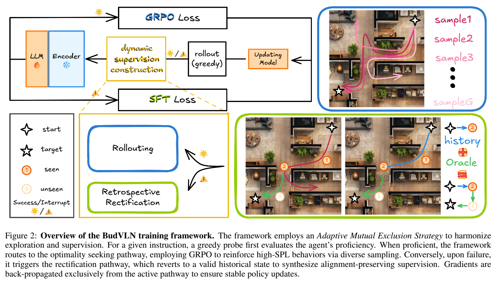
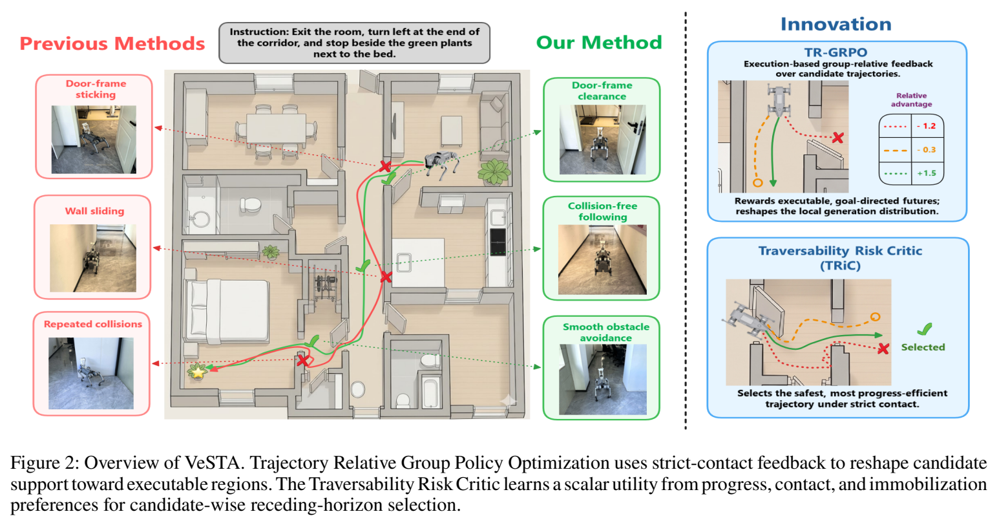

# 视觉语言导航 VLN

[返回主页](../README.md)

| 方法 | 研究内容 | 图表详情 |
| --- | --- | --- |
| BudVLN | 回溯校正、GRPO / SFT 动态在线学习 | [算法框架与导航结果](online-nav-training.md) |
| VeSTA | 严格接触反馈、候选轨迹优化、可通行风险评估 | [框架与无碰撞导航结果](collision-aware-navigation.md) |

## 语言指令实机演示

<table>
<tr><th width="50%">出门右转，在红色灭火器前停下</th><th width="50%">直行走出房间，进入左边的房间，在冰箱前停下</th></tr>
<tr>
<td align="center"></td>
<td align="center"></td>
</tr>
</table>

## BudVLN

| Val Unseen | SR ↑ | SPL ↑ |
| --- | ---: | ---: |
| R2R-CE | 57.6 | 51.1 |
| RxR-CE | 56.1 | 46.6 |

[完整实验表与轨迹对比 →](online-nav-training.md) · [开源项目](https://6zyyy.github.io/BudVLN/)

## VeSTA

| Go2 场景 | DualVLN 无碰撞成功率 | VeSTA 无碰撞成功率 |
| --- | ---: | ---: |
| 走廊 | 80% | 95% |
| 单卧室 | 55% | 65% |
| 跨房间 | 30% | 45% |

[严格接触仿真测试与实机结果 →](collision-aware-navigation.md)
