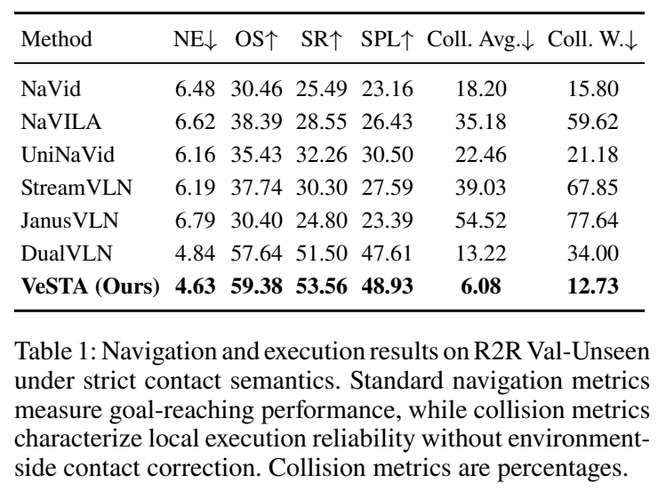
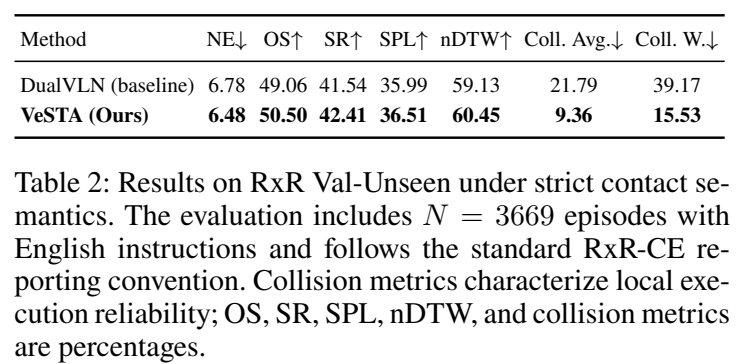
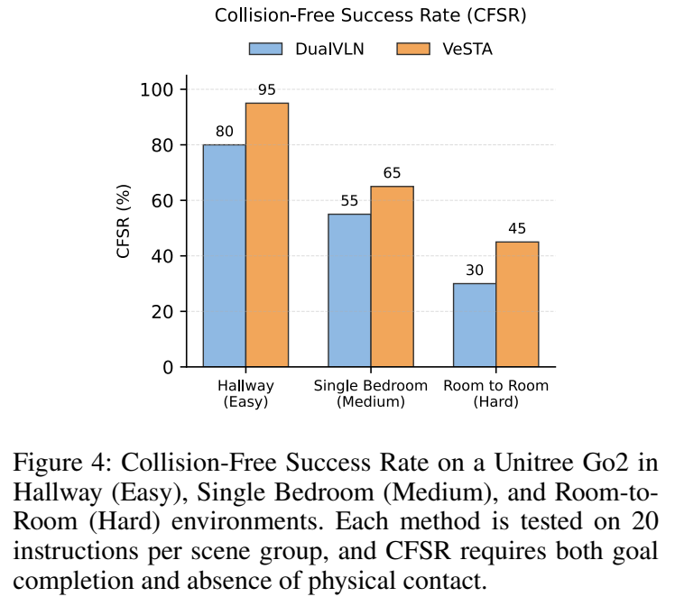

# VeSTA：可执行性与无碰撞导航

[返回 VLN](README.md) · [实验室主页](../README.md)

*Revealing and Bridging the Physical Executability Gap in Vision-Language Navigation*

| 模块 | 功能 |
| --- | --- |
| TR-GRPO | 利用严格接触反馈优化候选轨迹分布 |
| Traversability Risk Critic（TRiC） | 综合进展、接触与停滞信号评估候选轨迹 |
| 滚动执行 | 选择候选轨迹、执行局部前缀、重新规划 |

## 算法框架

## 严格接触条件下的结果

| 测试集 | 方法 | SR ↑ | Coll. W. ↓ |
| --- | --- | ---: | ---: |
| R2R Val Unseen | DualVLN | 51.50 | 34.00 |
| R2R Val Unseen | VeSTA | 53.56 | 12.73 |
| RxR Val Unseen | DualVLN | 41.54 | 39.17 |
| RxR Val Unseen | VeSTA | 42.41 | 15.53 |

## Go2 实机测试

| 场景 | 每方法指令数 | DualVLN CFSR | VeSTA CFSR |
| --- | ---: | ---: | ---: |
| 走廊 | 20 | 80% | 95% |
| 单卧室 | 20 | 55% | 65% |
| 跨房间 | 20 | 30% | 45% |
