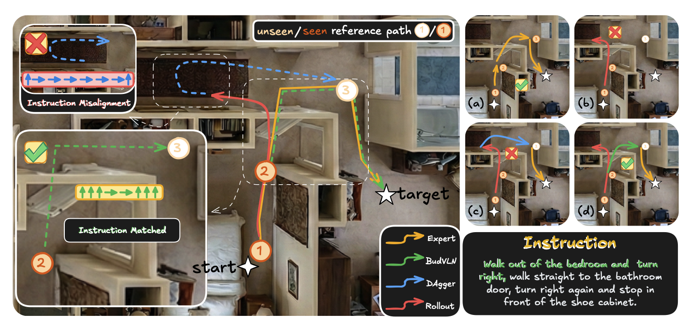
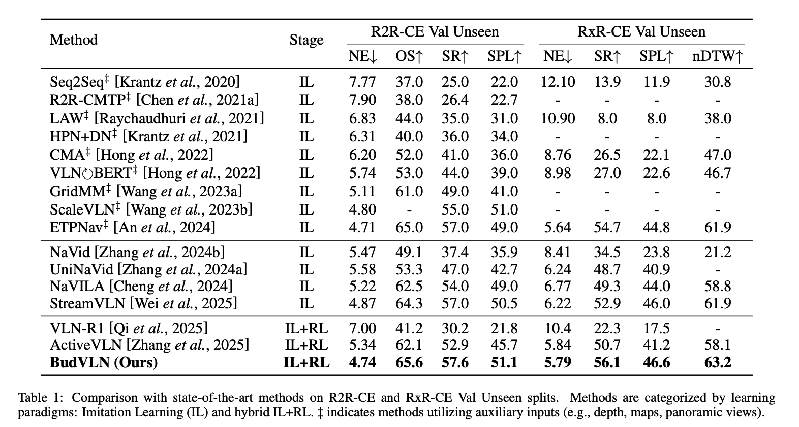
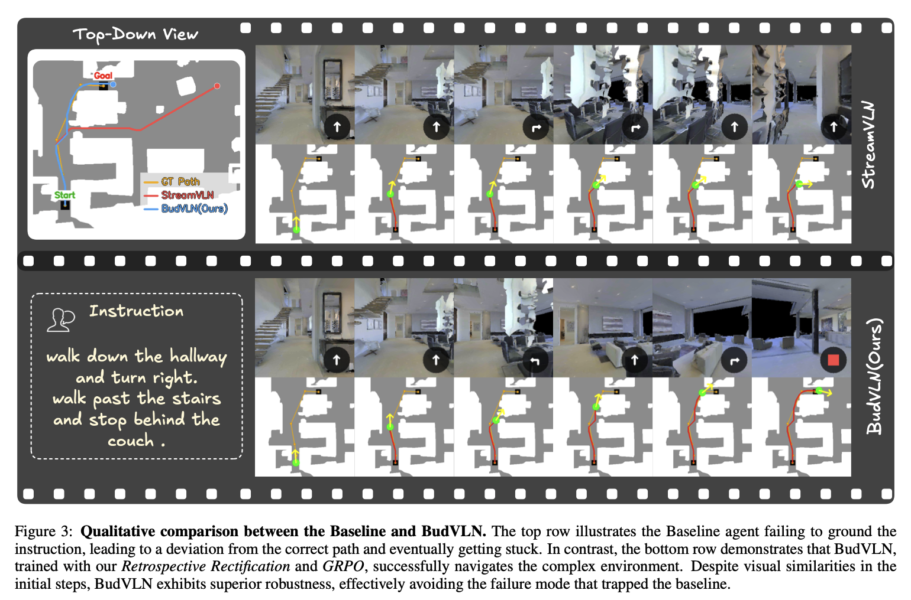

# BudVLN：回溯校正与在线训练

[返回 VLN](README.md) · [实验室主页](../README.md) · [开源项目](https://6zyyy.github.io/BudVLN/)

*Nipping the Drift in the Bud: Retrospective Rectification for Robust Vision-Language Navigation*

| 环节 | 方法 |
| --- | --- |
| 任务探测 | Greedy Probe 判断当前任务完成情况 |
| 成功轨迹 | GRPO 优化路径效率 |
| 失败轨迹 | 回溯至有效历史状态，生成与指令一致的监督轨迹 |
| 动态训练 | 根据探测结果选择 GRPO 或 SFT |

## 问题与算法框架

## 实验结果

| 数据集 / 划分 | NE ↓ | OS ↑ | SR ↑ | SPL ↑ | nDTW ↑ |
| --- | ---: | ---: | ---: | ---: | ---: |
| R2R-CE Val Unseen | 4.74 | 65.6 | 57.6 | 51.1 | — |
| RxR-CE Val Unseen | 5.79 | — | 56.1 | 46.6 | 63.2 |

| 训练对比 | 时间 | R2R-CE SR |
| --- | ---: | ---: |
| DAgger | 114 h | 57.1 |
| BudVLN | 27 h | 57.6 |

## 轨迹对比

来源：展示 PPT 第 21–22 页，所提供 BudVLN 论文图 2及实验部分。NE 为距离误差，SR 为成功率，SPL 兼顾成功与路径效率，nDTW 衡量轨迹相似度。
