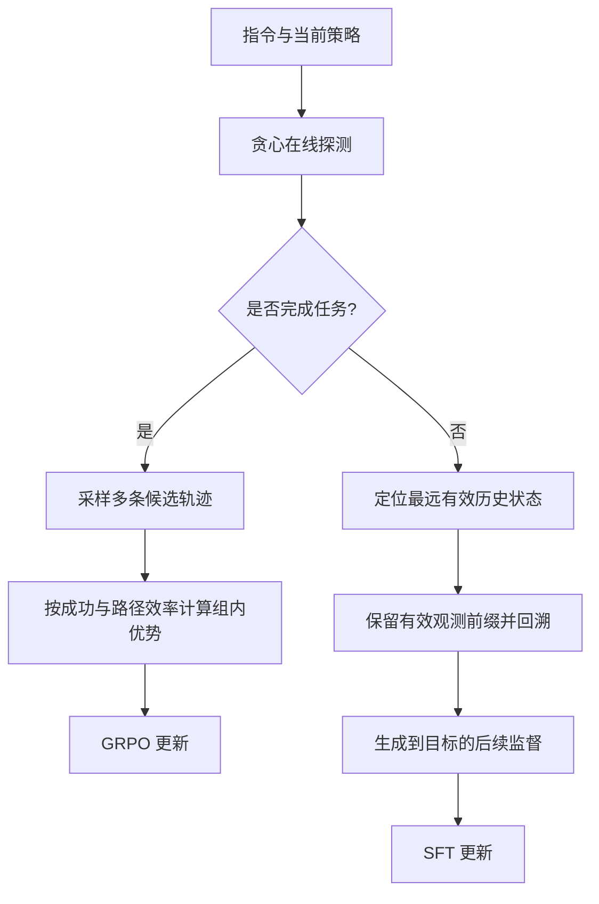

# 在线导航训练与轨迹校正

## 方法框架

训练时先用当前策略进行贪心探测，再按任务是否完成选择互斥的更新路径。已掌握任务通过组内采样和 GRPO 强化更有效率的轨迹；未完成任务回到策略历史中最远的有效进展状态，保留该状态之前的观测历史，并由导航先验生成后续监督，减少从错误状态直接纠错导致的指令—状态错位。

## 结果概览

| 基准 | 指标 | 结果 | 对照结果 |
|---|---:|---:|---:|
| R2R-CE Val-Unseen | SR | 57.6% | 同表最强对照 57.0% |
| R2R-CE Val-Unseen | SPL | 51.1% | 同表最强对照 50.5% |
| RxR-CE Val-Unseen | SR | 56.1% | 同表最强对照 52.9% |
| RxR-CE Val-Unseen | SPL | 46.6% | 同表最强对照 46.0% |

在报告的 R2R-CE 训练时长对比中，该流程用 27 小时达到 57.6% SR；对照 DAgger 流程为 114 小时、57.1% SR。训练时长受硬件和实现影响，仅代表材料所列实验设置。
